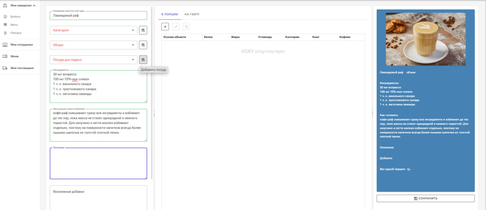

# 🍽️ BotControllerGI — Telegram Bot Management Platform for Cafés & Restaurants

## 📌 Описание проекта

**BotControllerGI** — это мой пет-проект, созданный на базе **Blazor WebAssembly**, предназначенный для управления информационным Telegram-ботом, который помогает автоматизировать процессы в кафе и ресторанах.

Платформа предоставляет удобный веб-интерфейс для:

- 📋 Составления меню с указанием:
  - Названия блюд и напитков
  - Категории меню (холодные, горячие блюда, напитки)
  - Граммовки
  - Состава
  - КБЖУ (калорийность, белки, жиры, углеводы)

- 👥 Управления доступом пользователей к функционалу бота

- 🤖 Связи с Telegram-ботом, который отображает актуальную информацию клиентам заведения

   Сам бот написан тоже на .Net все запросы осуществляются через https для теста бота необходимо настроить тунелирование через ngrok

Архитектура проекта построена на принципах RESTful — все взаимодействия между клиентом и сервером происходят через стандартизированные HTTP-запросы. Это обеспечивает гибкость и совместимость с внешними системами. Внутреннее устройство кода следует принципам SOLID.

## 🛠️ Технологии
- **Blazor WebAssembly** — фронтенд на C# с возможностью запуска в браузере
- **ASP.NET Core** — серверная часть (если используется)
- **Telegram Bot API** — интеграция с Telegram
- **Entity Framework Core** — работа с базой данных (если применимо)
- **SOLID-принципы** — архитектура проекта построена с соблюдением принципов SOLID для обеспечения масштабируемости, читаемости и лёгкой поддержки кода

пара примеров 

